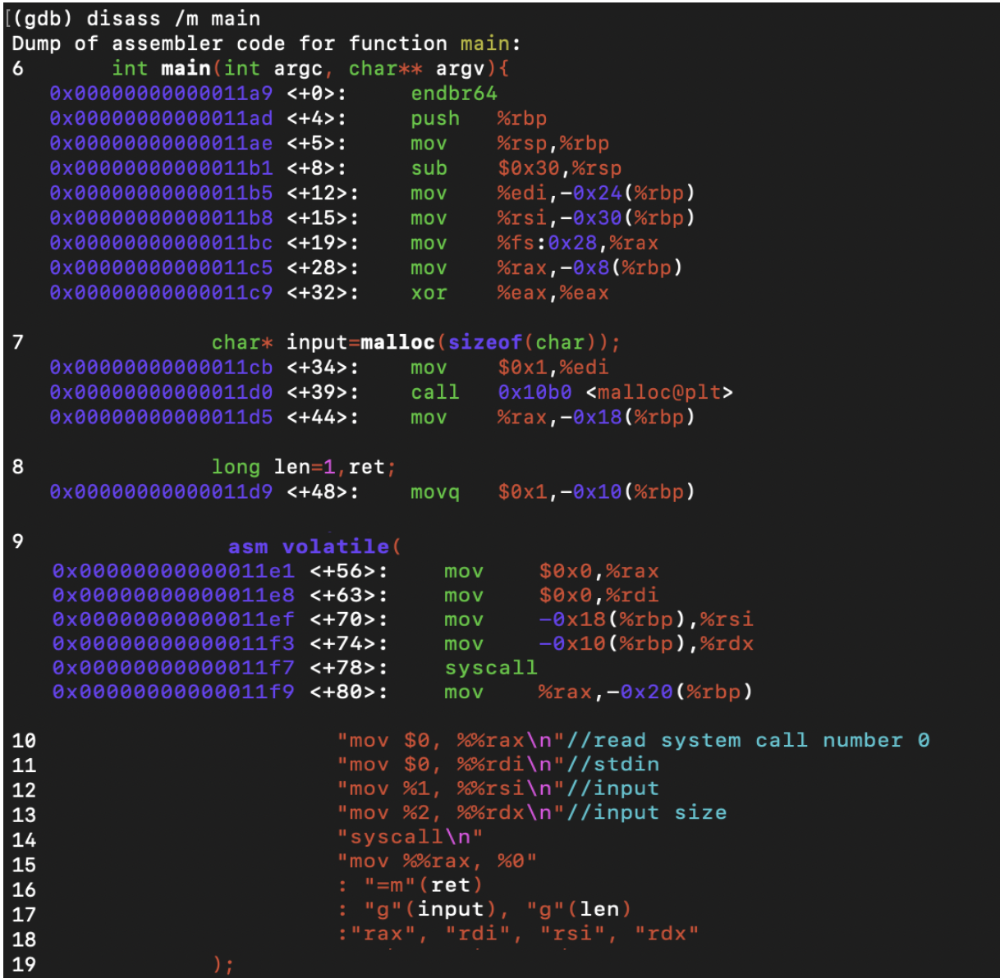
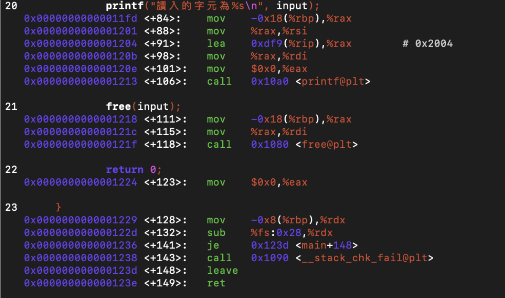

### 使用組合語言呼叫 system call

stdin\_read  進行反組譯 

在<+34>行的部分％edi 內放入 1，是 malloc 的長度\\
在<+44>把 input 的資訊放入%rbp  的  0x18 \\
在<+48>行把 len 的 1 放入%rbp  的 0x10\\

進入  inline assembly 的部分前兩行都相同 \\
在<+70><+74>可以看到將％rbp 0x18( input )放入%rsi  \\
%rbp 0x10(input size 1 )放入％rdx \\

