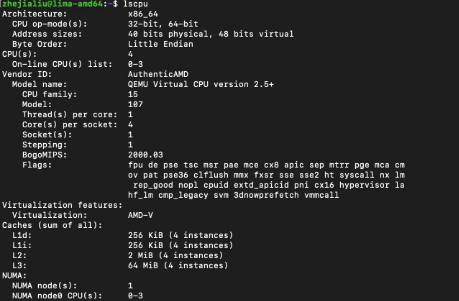
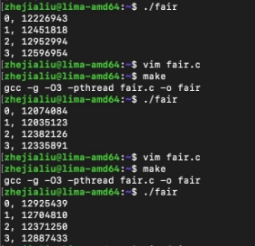

### memory order and atomic operations

型號：QEMU Virtual CPU verision 2.5+  
執行環境：Linux lima-amd64 5.15.0-52-generic x86\_64 GNU/Linux  核心數：4 
delay\_size = rand\_r(&rand\_seq)%a  藉由改變 a 的值來觀察： 

a=73  亂數的等待時間的範圍越大時

就有較大的機率獲得較公平的結果，但是由 a＝1993 的結果發現，  
相較 a=947 並沒有比較公平，所以只是有更大的機會獲得公平的結果。 
